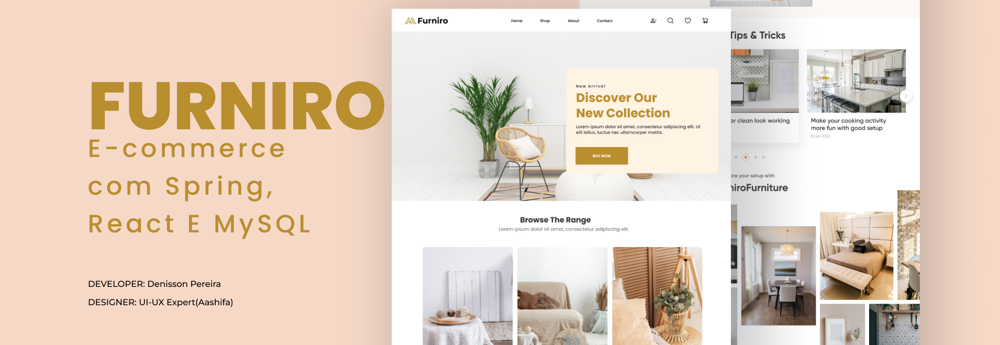
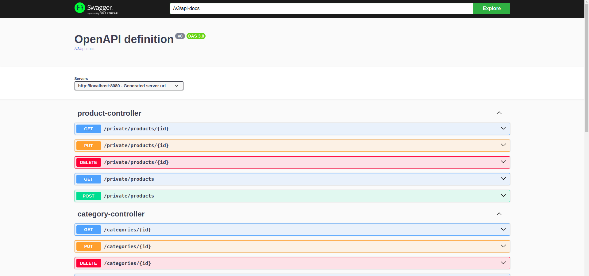
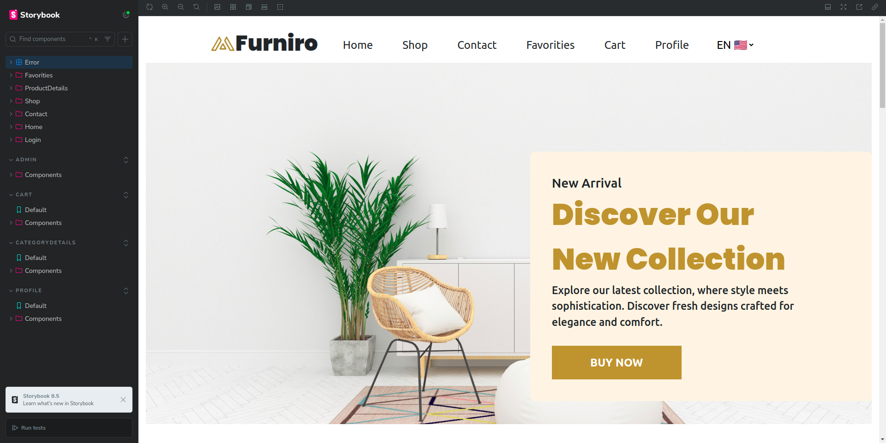
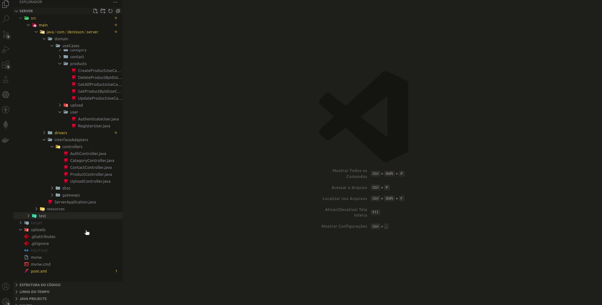

 

<p align="center">
  <a href="https://github.com/Denisson-Pereira/furniro-ecommerce-spring-react-mysql"></a>
  <a href="https://github.com/Denisson-Pereira/furniro-ecommerce-spring-react-mysql/issues"></a>
  <a href="https://github.com/Denisson-Pereira/furniro-ecommerce-spring-react-mysql/graphs/contributors"></a>
  <a href="https://github.com/Denisson-Pereira/furniro-ecommerce-spring-react-mysql/commits/main"></a>
  <a href="https://github.com/Denisson-Pereira/furniro-ecommerce-spring-react-mysql/stargazers"></a>
</p>

# 📝 Sumário

1. [Sobre o Projeto](#-sobre-o-projeto)
2. [Stack Tecnológica e Descrições](#-stack-tecnológica-e-descrições)
   - [Backend](#-backend)
      - [Estrutura do Banco de Dados](#-estrutura-do-banco-de-dados)
   - [Frontend](#-frontend)
   - [Design](#-design)
3. [DevOps e CI/CD](#-devops-e-cicd)
4. [Pré-requisitos](#-pré-requisitos)
5. [Como Executar o Projeto](#-como-executar-o-projeto)
   - [Clonar Repositório Git](#-clonar-repositório-git)
   - [Acessar Backend](#-acessar-backend)
   - [Documentação](#-documentação)
      - [Doc Backend](#-doc-backend)
      - [Doc Frontend](#-doc-frontend)
6. [Software em Ação](#-software-em-ação)
7. [Edição](#-edição)   
8. [Aguarde! Ainda Não Terminou!](#-aguarde-ainda-não-terminou)
9. [Licença](#-licença)
10. [Design Credits](#-design-credits)
11. [Referências Bibliográficas](#-referências-bibliográficas)

# 📑 Sobre o projeto 


O **Furniro** é um projeto *fullstack* de *e-commerce* baseado em um design do **Figma** desenvolvido com **Clean Architecture** em todas as suas camadas, tanto no *backend* quanto no *frontend*, seguindo os princípios do **SOLID** e do **Clean Code**. O servidor, construído em **Java** com **Spring Boot**, utiliza **JDBC** e **MySQL** para a persistência de dados, garantindo eficiência e escalabilidade. Além disso, conta com um robusto sistema de autenticação, implementado com **Spring Security**, **JWT** e **BCrypt**, proporcionando mais segurança. Para maior flexibilidade, o projeto também incorpora um mecanismo avançado de **upload** de arquivos, tornando a experiência ainda mais completa e segura.

O *frontend* foi desenvolvido com **React**, **TypeScript** e o padrão **MVVM**, garantindo uma interface moderna e performática. Para assegurar a qualidade do código, foram utilizadas ferramentas como **Jest** e **Vitest** para testes automatizados, além do **Storybook** para a documentação dos componentes. Ademais, o projeto conta com **Docker** e internacionalização via **i18n**, suportando **sete** idiomas.

# 📚 Stack Tecnológica e Descrições

## • Backend

[](https://www.java.com/)

[](https://spring.io/)


O *backend* deste projeto foi desenvolvido seguindo os princípios da **Clean Architecture**, garantindo uma estrutura de código organizada e escalável. A documentação da **API** foi feita com **Swagger**, facilitando a integração e o entendimento das rotas. As entidades ``Product`` e ``Category`` possuem os métodos **POST**, **PUT**, **GET** e **DELETE**, permitindo a criação, atualização, consulta e remoção de registros. O sistema conta também com um robusto **upload** de arquivos para contatos e autenticação segura utilizando **JWT** e **BCrypt**. Com **Spring Security**, foi possível proteger rotas privadas, enquanto exceções personalizadas oferecem um controle preciso sobre erros, proporcionando uma experiência mais consistente para os usuários.

### 🚨 Atenção!

>Uso de Variáveis de Ambiente:

```
${USERNAME_BANCO}
${SENHA_BANCO}
```

## 💾 Estrutura do Banco de Dados

O banco de dados **furniro** é composto por quatro tabelas, com `products` sendo a principal responsável por fornecer os produtos da loja.

| Campo          | Tipo         | Descrição                          |
|----------------|--------------|------------------------------------|
| id             | int       | Identificador único do produto      |
| name           | varchar(100) | Nome do produto                    |
| description    | text | Descrição do produto               |
| image          | varchar(255) | URL da imagem do produto           |
| category       | varchar(100) | Categoria do produto               |
| price          | varchar(20) | Preço do produto                   |

## • Frontend


A parte *web* do projeto foi desenvolvida com **React** em **TypeScript**, seguindo o padrão **MVVM (Model-View-ViewModel)**, que separa a lógica da interface para melhor organização e manutenção do código. Além disso, foram aplicados os princípios da **Clean Architecture**, **Repository Pattern** e **Arquitetura Hexagonal**, garantindo modularidade, escalabilidade e fácil substituição de dependências. Para assegurar a qualidade do código, foram implementados testes automatizados com **Jest**, **Vitest** e **Cypress**, com automação via **GitHub Actions**. O gerenciamento de estado global foi realizado com **Context API**, e a internacionalização foi implementada com **i18n**, suportando sete idiomas. A documentação dos componentes foi feita com **Storybook**, e *generics* foram utilizados para otimizar casos de uso semelhantes.

O *design* da aplicação foi cuidadosamente planejado para garantir responsividade, utilizando **SASS** para estilizações avançadas, além de **Bootstrap** para facilitar a construção da interface. Todas as requisições foram feitas utilizando o **fetch** nativo do **React**, garantindo leveza e controle sobre as chamadas à *API*. A navegação foi estruturada com **React Router DOM**, e a paginação dos itens da loja foi implementada de forma nativa, sem o uso de bibliotecas externas. O projeto também foi containerizado com **Docker** e utilizou variáveis de ambiente para maior flexibilidade e segurança na configuração.

## • Design


[](https://canvas.instructure.com/)

O projeto **Furniro** foi inspirado em um *design* previamente criado no **Figma** pelo autor **UI-UX Expert (Aashifa) @uiux_expert**, servindo como referência para a interface e experiência do usuário. Além disso, algumas imagens foram criadas e editadas utilizando **Adobe Photoshop** e **Canvas**, garantindo um acabamento visual refinado e alinhado com a identidade do projeto.

# 🚀 DevOps e CI/CD


Para garantir a qualidade e a automação dos processos de desenvolvimento, esta aplicação utiliza o **GitHub Actions** como ferramenta de **CI/CD** (*Continuous Integration/Continuous Deployment*). Com isso, os testes automatizados são executados a cada novo *commit* ou *pull request*, utilizando **Jest e Vitest** para validar a integridade do código. Essa abordagem ajuda a detectar erros precocemente e mantém a aplicação mais confiável e estável.

# ⚙ Pré-requisitos

**Certifique-se de ter o o Java 17 e npm**

Antes de mais nada, é necessário verificar se o **Java 17** e o **npm** estão instalados em sua máquina. Você pode baixá-los e instalá-los a partir dos sites oficiais: 


[](https://www.npmjs.com/)

# 👨‍💻 Como executar o projeto

## 👯 Clonar repositório git

```
git clone https://github.com/Denisson-Pereira/furniro-ecommerce-spring-react-mysql
```

## 🏧 Acessar Backend

Após clonar o repositório, para acessar o backend, basta digitar o seguinte comando no terminal:

```
cd server
```

Você pode rodar a aplicação com o seguinte comando:

```
mvn spring-boot:run
```

Esse comando irá compilar e rodar a aplicação diretamente no terminal.


## 🖥️ Rodar o Frontend

Após clonar o repositório, para acessar o frontend, basta digitar o seguinte comando no terminal:

```
cd web
```

Para ver o projeto, certifique-se de que o backend está rodando e digite:

```
npm run dev
```

Lembre-se de que os dados do banco estão localizados, a partir da raiz do projeto, em `database/Dump20250212.sql`.

# 📁 Documentação

## • Doc Backend


Para acessar a documentação da API, basta visitar a URL:

```
http://localhost:8080/swagger-ui/index.html#/
```

 

## • Doc Frontend


Para acessar a documentação dos componentes, basta digitar no terminal:

```
npm run storybook
```

 

# 💻 Software em Ação

## • Um tour pela aplicação:
 

## • Criando uma mensagem de contato e enviando uma imagem para o backend:
 

## • Finalizando a compra:
 


# 📺 Edição

No desenvolvimento deste projeto, foram utilizados os seguintes editores:


O *backend* da aplicação foi desenvolvido utilizando o **IntelliJ IDEA**, garantindo um ambiente robusto e eficiente para o código. A manipulação do banco de dados foi realizada com o **MySQL Workbench**, facilitando a gestão e modelagem dos dados. Já o *frontend* foi criado no **Visual Studio Code**, proporcionando uma interface moderna e intuitiva para a aplicação.

# 🚨 Aguarde! Ainda não terminou!

>Este projeto está atualmente em desenvolvimento, e está sujeito a futuras atualizações e melhorias conforme evolui. Estamos trabalhando para torná-lo ainda mais robusto e funcional ao longo do tempo. Agradecemos sua paciência e interesse nesta fase inicial.

>Por fim, gostaríamos de ressaltar que este projeto é aberto a contribuições de qualquer pessoa interessada em colaborar. Se você tem ideias, sugestões ou melhorias para oferecer, sinta-se à vontade para participar do desenvolvimento do projeto. Juntos, podemos criar algo incrível e beneficiar a comunidade de forma colaborativa.

# 🎨 Design Credits

[eCommerce Website | Web Page Design | UI KIT | Interior Landing Page](https://www.figma.com/community/file/1252561852327562039/ecommerce-website-web-page-design-ui-kit-interior-landing-page) Figma Community Design

# 📜 Licença

[](https://github.com/Denisson-Pereira/furniro-ecommerce-spring-react-mysql/blob/main/LICENSE) 

# 📝 Referências Bibliográficas  

MARTIN, S. R. **Código Limpo: Habilidades Práticas do Agile Software**. Rio de Janeiro: Alta Books, 2011.
MARTIN, S. R. **Arquitetura Limpa: O Gui do Artesão para Estrutura e Design de Software**. Rio de Janeiro: Alta Books, 2018.