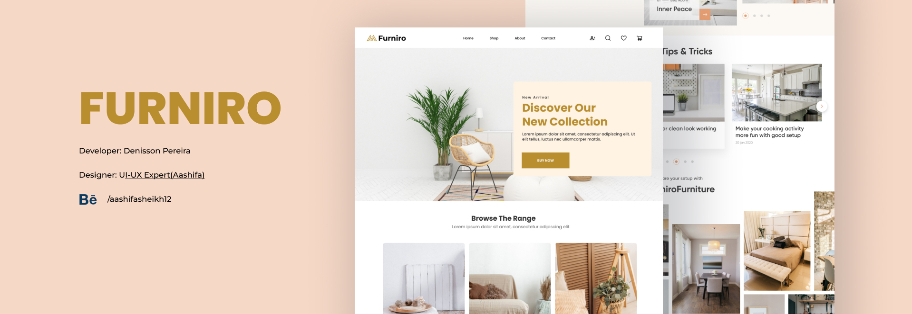

 

<p align="center">
  <a href="https://github.com/Denisson-Pereira/furniro-ecommerce-spring-react-mysql"></a>
  <a href="https://github.com/Denisson-Pereira/furniro-ecommerce-spring-react-mysql/issues"></a>
  <a href="https://github.com/Denisson-Pereira/furniro-ecommerce-spring-react-mysql/graphs/contributors"></a>
  <a href="https://github.com/Denisson-Pereira/furniro-ecommerce-spring-react-mysql/commits/main"></a>
  <a href="https://github.com/Denisson-Pereira/furniro-ecommerce-spring-react-mysql/stargazers"></a>
</p>

# 📝 Sumário

1. [Sobre o Projeto](#-sobre-o-projeto)
2. [Stack Tecnológica e Descrições](#-stack-tecnológica-e-descrições)
   - [Backend](#-backend)
        - [Princípios SOLID](#-princípios-solid)
        - [Design patterns](#-design-patterns)
        - [Estrutura do Banco de Dados](#-estrutura-do-banco-de-dados)
   - [Frontend](#-frontend)
   - [Design](#-design)
3. [Pré-requisitos](#-pré-requisitos)
4. [Como Executar o Projeto](#-como-executar-o-projeto)
   - [Clonar Repositório Git](#-clonar-repositório-git)
   - [Acessar Backend](#-acessar-backend)
   - [Documentação](#-documentação)
5. [Visuals and Screenshots](#-visuals-and-screenshots)
   - [Software em Ação](#-software-em-ação)
6. [Edição](#-edição)   
7. [Aguarde! Ainda Não Terminou!](#-aguarde-ainda-não-terminou)
8. [Licença](#-licença)
9. [Design Credits](#-design-credits)
10. [Referências Bibliográficas](#-referências-bibliográficas)

# 📑 Sobre o projeto 

O **Furniro** é um projeto *fullstack* de *e-commerce* baseado em um design do **Figma** desenvolvido com **Clean Architecture** em todas as suas camadas, tanto no *backend* quanto no *frontend*, seguindo os princípios do **SOLID** e do **Clean Code**. O servidor, construído em **Java** com **Spring Boot**, utiliza **JDBC** e **MySQL** para a persistência de dados, garantindo eficiência e escalabilidade. Além disso, conta com um robusto sistema de autenticação, implementado com **Spring Security**, **JWT** e **BCrypt**, proporcionando mais segurança. Para maior flexibilidade, o projeto também incorpora um mecanismo avançado de **upload** de arquivos, tornando a experiência ainda mais completa e segura.

O *frontend* foi desenvolvido com **React**, **TypeScript** e o padrão **MVVM**, garantindo uma interface moderna e performática. Para assegurar a qualidade do código, foram utilizadas ferramentas como **Jest** e **Vitest** para testes automatizados, além do **Storybook** para a documentação dos componentes. Ademais, o projeto conta com **Docker** e internacionalização via **i18n**, suportando **sete** idiomas.


# 📚 Stack Tecnológica e Descrições

## • Backend

[](https://www.java.com/)

[](https://spring.io/)


O *backend* deste projeto foi desenvolvido seguindo os princípios da **Clean Architecture**, garantindo uma estrutura de código organizada e escalável. A documentação da **API** foi feita com **Swagger**, facilitando a integração e o entendimento das rotas. As entidades ``Product`` e ``Category`` possuem os métodos **POST**, **PUT**, **GET** e **DELETE**, permitindo a criação, atualização, consulta e remoção de registros. O sistema conta também com um robusto **upload** de arquivos para contatos e autenticação segura utilizando **JWT** e **BCrypt**. Com **Spring Security**, foi possível proteger rotas privadas, enquanto exceções personalizadas oferecem um controle preciso sobre erros, proporcionando uma experiência mais consistente para os usuários.

# 🚨 Atenção!

>Uso de Variáveis de Ambiente:

```
${USERNAME_BANCO}
${SENHA_BANCO}
```


### 💾 Estrutura do Banco de Dados

O banco de dados `foodhub` contém três tabelas principais: `category`, `product` e `user`.

### Tabela: category

| Campo   | Tipo         | Descrição                               |
|---------|--------------|-----------------------------------------|
| id      | int       | Identificador único da categoria        |
| name    | varchar(255) | Nome da categoria                       |
| image   | varchar(255) | URL da imagem da categoria              |


### Tabela: product

| Campo          | Tipo         | Descrição                          |
|----------------|--------------|------------------------------------|
| id             | int       | Identificador único do produto      |
| name           | varchar(255) | Nome do produto                    |
| evaluation     | varchar(255) | Avaliação do produto               |
| description    | varchar(255) | Descrição do produto               |
| price          | varchar(255) | Preço do produto                   |
| category       | varchar(255) | Categoria do produto               |
| establishment   | varchar(255) | Estabelecimento onde o produto está disponível |
| image          | varchar(255) | URL da imagem do produto           |


### Tabela: user

| Campo   | Tipo         | Descrição                               |
|---------|--------------|-----------------------------------------|
| id      | int       | Identificador único do usuário          |
| name    | varchar(255) | Nome do usuário                         |
| login   | varchar(255) | Login do usuário                        |
| password| varchar(255) | Senha do usuário                       |


## • Frontend


O aplicativo foi desenvolvido utilizando **React Native**, uma abordagem que permite a construção de plataformas para **iOS** e **Android** de forma eficiente e integrada. Para alinhar com a **Clean Architecture** do *backend*, adotou-se o padrão **MVVM**, que promove a separação entre a lógica de negócios e os componentes da interface do usuário. Essa escolha reflete a intenção de minimizar o uso de *frameworks* e bibliotecas, criando uma plataforma robusta e escalável para o futuro.

Além disso, o aplicativo faz uso do **Context API** para gerenciar diversos aspectos do sistema, como o controle de usuários, informações de produtos e estabelecimentos, autenticação de usuários com rotas privadas, cadastro e login de usuários, e o gerenciamento do carrinho de compras, que inclui a funcionalidade de cupons de desconto. Essa estrutura foi pensada para garantir uma experiência de uso fluida e um gerenciamento eficiente dos dados.

## • Design


[](https://canvas.instructure.com/)

O **Adobe Photoshop** foi empregado para a edição e manipulação de imagens, garantindo qualidade e profissionalismo. Além disso, **Figma** foi utilizado para criar protótipos e layouts, facilitando a visualização e a colaboração no design da interface. Para capturas de tela e materiais educacionais, recorreu-se ao **Canvas**, que oferece uma plataforma intuitiva para a criação e compartilhamento de conteúdos visuais.

# ⚙ Pré-requisitos

**Certifique-se de ter o o Java 17**

Antes de mais nada, é necessário verificar se o Java 17 está instalado em sua máquina. Você pode baixá-lo e instalá-lo a partir do site oficial da Oracle.


# 🚀 Como executar o projeto

## 👯 Clonar repositório git

```
git clone https://github.com/Denisson-Pereira/foodhub-app
```

## 🏧 Acessar Backend

Após clonar o repositório, para acessar o backend, basta digitar o seguinte comando no terminal:

```
cd backend
```

Você pode rodar a aplicação com o seguinte comando:

```
mvn spring-boot:run
```

Esse comando irá compilar e rodar a aplicação diretamente no terminal.

 

## Rodar o Mobile

Após clonar o repositório, para acessar o mobile, basta digitar o seguinte comando no terminal:

```
cd mobile
```

Para ver o projeto, certifique-se de que o backend está rodando e digite:

```
npx expo start
```

Esse comando é usado para iniciar um projeto desenvolvido com Expo.

 

Lembre-se de que os dados do banco estão localizados, a partir da raiz do projeto, em `database/Dump20240831.sql`.

## 📱 Documentação

Para acessar a documentação da API, basta visitar a URL:

```
http://localhost:8080/swagger-ui/index.html#/
```

 

# 📸 Visuals and Screenshots

Dê uma espiada no nosso projeto em funcionamento e esclareça todas as suas dúvidas sobre como executá-lo!

<div style="display: flex; gap: 10px;">
    
    
    
    
    
    
</div>


## 💻 Software em Ação

 


# 📺 Edição

No desenvolvimento deste projeto, foram utilizados os seguintes editores:


# 🚨 Aguarde! Ainda não terminou!

>Este projeto está atualmente em desenvolvimento, e está sujeito a futuras atualizações e melhorias conforme evolui. Estamos trabalhando para torná-lo ainda mais robusto e funcional ao longo do tempo. Agradecemos sua paciência e interesse nesta fase inicial.

>Por fim, gostaríamos de ressaltar que este projeto é aberto a contribuições de qualquer pessoa interessada em colaborar. Se você tem ideias, sugestões ou melhorias para oferecer, sinta-se à vontade para participar do desenvolvimento do projeto. Juntos, podemos criar algo incrível e beneficiar a comunidade de forma colaborativa.

# 🎨 Design Credits

[FoodHub](https://www.figma.com/community/file/1016293188579696778/food-app-foodhub-community) Figma Community Design

# 📜 Licença

[](https://github.com/Denisson-Pereira/foodhub-app/blob/main/LICENSE) 

# 📝 Referências Bibliográficas  

MARTIN, S. R. **Código Limpo: Habilidades Práticas do Agile Software**. Rio de Janeiro: Alta Books, 2011.
MARTIN, S. R. **Arquitetura Limpa: O Gui do Artesão para Estrutura e Design de Software**. Rio de Janeiro: Alta Books, 2018.